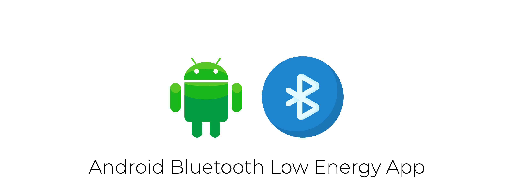

## Android Bluetooth Low Energy App

This repository contains a detailed sample app that connects to a BLE device in Android (Kotlin).

## Dependencies
The sample app is using next libraries and frameworks:
- [RxJava](https://github.com/ReactiveX/RxJava)
- [RxPermissions](https://github.com/tbruyelle/RxPermissions)

## References
- [GATT description](https://www.bluetooth.com/specifications/gatt/)

If you have any suggestions or questions feel free to make a Pull Request or contact us!

## Author
#### Dmytro Lisovyi
Android developer at [OmiSoft](https://omisoft.net/?utm_source=github&utm_medium=social)

<!-- Please don't remove this: Grab your social icons from https://github.com/carlsednaoui/gitsocial -->

[![alt text][1.1]][1]
[![alt text][2.1]][2]

[1]: http://www.twitter.com/omisoftnet
[2]: http://www.facebook.com/omisoftnet

[1.1]: http://i.imgur.com/wWzX9uB.png (twitter icon without padding)
[2.1]: http://i.imgur.com/fep1WsG.png (facebook icon without padding)

## License
Android Bluetooth Low Energy App is released under the MIT license.  
See the [LICENSE](./LICENSE.md) for details.
